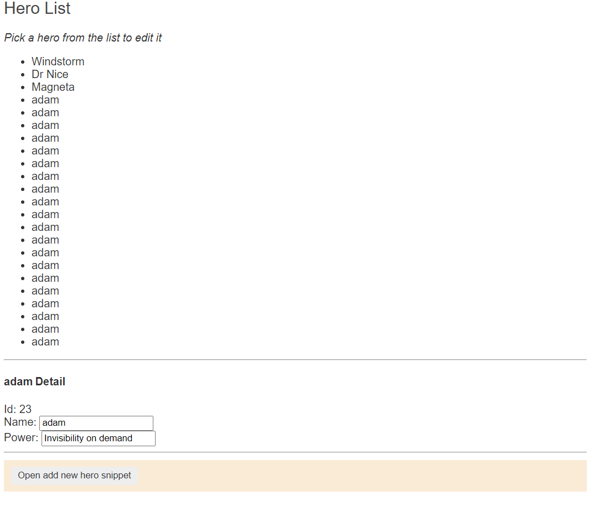

# tester-tutorial

## Komendy linii poleceń:
- `ls` - pokazuje zawartość folderu w którym obecnie się znajdujesz
- `cd <nazwa-folderu>` - wchodzisz do folderu o nazwie <nazwa-folderu>. Jeżeli chcesz wyjść 'poziom wyżej' to używasz ../. Na przykład: `cd ../`

## Komendy gita:
- `git status` - pokazuje podstawowe informacje (na przykład które pliki zostały zmienione)
- `git fetch` - pobiera zmiany z 'remota' które inni spushowali i ale nie aplikuje ich do twojego lokalnego brancha
- `git branch <new-branch-name>` - tworzy nowego brancha
- `git checkout <existing-branch-name>` - zmienia brancha na którym się znajdujesz na <existing-branch-name>
- `git checkout -b <new-branch-name>` - połączenie dwóch poleceń wyżej
- `git diff <branch-name> <other-branch-name>` - pokazuje różnice między jednym branchem, a drugim (w zawartości plików). Używanie linii poleceń do tego nie jest zbyt wygodne, więc często używa się do tego innych narzędzi
- `git add <files>` - oznaczasz pliki, które chcesz za chwile 'scommitować'
- `git add -A` - oznaczasz wszystkie zmienione pliki, które chcesz za chwile 'scommitować'
- `git commit -m "komentarz"` - commituje pliki, razem z komentarzem
- `git push` - wrzuca scommitowene zmiany na 'remota' (tak, żeby ktokolwiek inny też je widział)
- `git merge <name-of-branch>` - dodaje zmiany z brancha <name-of-branch> do brancha na którym obecnie się znajdujesz
- `git pull` - pobiera zmiany z 'remota' które inni spushowali i aplikuje je do twojego lokalnego brancha
- `git log` - pokazuje ci liste commitów
TO CO JEST NAJWAŻNIEJSZE:

1) Chcesz się upewnić że twój branch jest aktualny (zwykle robisz to rano, po zmianie brancha, albo po tym gdy wiesz że ktoś spushował zmiany do brancha nad którym pracujesz)
- `git pull`

2) Chcesz wrzucić wszystkie swoje zmiany, tak żeby były widoczne dla innych
- `git add -A`
- `git commit -m "your comment"`
- `git push`

3) Po stworzeniu nowego brancha chcesz wypchąć swoje zmiany, tak żeby inni je widzieli, ale na remocie nie ma jeszcze brancha:
- `git push --set-upstream origin <nazwa-brancha>`
Jeżeli tego nie pamiętasz, uzyj  po prostu `git push`, a git podpowie ci całą komendę

## CSSowe selektory
 - `#` - id
 - `.` - class
 - ` ` (nic) - selektor htmlowy

 Co do łączenia selektorów:
 - `>` - wskazuje na bezpośrenio potomka (dziecko) jakiegoś elementu. Na przykład `.super-klasa > .nazwa-klasy` wybierze element z klasą `nazwa-klasy`, ale tylko taki, który jest dzieckiem elementu z klasą `super-klasa`
 - ` ` (spacja) - wskazuje na bliżej niesprecyzowaneg potomka jakiegoś elementu. Na przykład `.super-klasa .nazwa-klasy` wybierze wszystkie elementy z klasą `nazwa-klasy`, które są dzieckiem/wnukiem/prawnukiem/... elementu z klasą `super-klasa`

 Czasem używa się też selektorów 'porządkowych':
 - `first-child`
 - `only-child`
 - `last-child`
 - `nth-child(x)` - (x jest liczbą).

 Są jeszcze inne, ale są praktycznie nieużywane.

 Seletory można łączyć ze sobą - na przykład `div.nazwa-klasy` wybierze element div, który jednocześnie ma klase 'nazwa-klasy'.

 Ściąga: https://appletree.or.kr/quick_reference_cards/CSS/CSS%20selectors%20cheatsheet.pdf

## Zadania
1) Przetestuj funkcjonalność edytowania danych (imienia i supermocy bohatera)
2) Przetestuj funkcjonalność dodawania nowego bohatera (guzik add)
3) Przetestuj funkcjonalność cancelowania dodawania (guzik cancel) - formularz po scancelowaniu i ponownym otwarciu nie powinien mieć wypełnionego pola 'name'.

Zadanie z gwiadką:
4) Przetestuj funkcjonalność dodawania wielu bohaterów. Do początkowych 3 (Windstorm, Dr. Nice i Magneta) dodaj kolejnych 20.
   Sprawdź czy ID ostatniego bohatera to '23'. Powinno to wyglądać mniej więcej tak:
    
	Podpowiedzi:
		* żeby nie powtarzać 20 razy kodu dodawania nowego bohatera wykorzystaj pętlę (na przykład pętlę loop).
		Przykład użycia tutaj: https://github.com/DevExpress/testcafe/issues/1621#issuecomment-315879489 (ten pierwszy przykład w odpowiedzi AlexandraMoskovkina)
		* w testcafie nie jest tak, że cały kod testu musi być nieprzerwanym ciągiem. Te 2 testy są równoważne i zachowują się dokładnie tak samo: